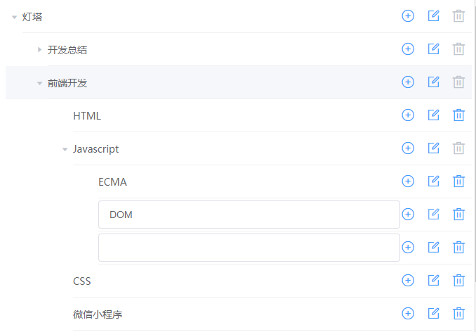
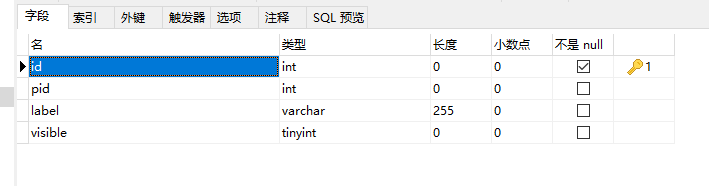

# 灯塔项目
用于梳理逻辑
## 技术
- 前端:VUE+ElementUi+axios为了减少打包的操作，没有使用脚手架，
- 后端:nodeJs+Express
- 数据库：MySQL

## 项目预览

## 表的设计
id设置自增，pid为父级id


## 启动项目
需要nodejs,mysql
- [windows下MySQL的安装和配置](https://blog.csdn.net/weixin_35958891/article/details/105160680)
```cmd
node main
```

浏览器运行：http://localhost:3060/